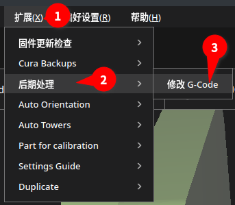
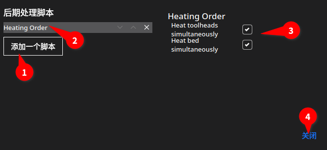

# Cura Heat Order Script

A cura post-processing script to reorder preheaters to make toolheads and bed heat up simultaneously.  

For common printers a custom start gcode is enough. However for a printer with multiple toolheads the start gcode isn't flexible enough.  

To install, copy or symlink the HeatOrder.py file to you user script directory:
- Windows: `%AppData%\cura\CURA_VERSION\scripts`.  
- Linux Appimage: `$HOME/.local/share/cura/CURA_VERSION/scripts` (check `$HOME/.config/cura/CURA_VERSION/scripts` if this doesn't work)
Cura needs to be restarted if it's already running.  

Usage: Extensions > Post Processing > Modify G-Code, Add a script > Heat Order

Licensed under CC BY-NC-SA 4.0.  
[![CC BY-NC-SA 4.0][cc-by-nc-sa-image]][cc-by-nc-sa]

[cc-by-nc-sa]: http://creativecommons.org/licenses/by-nc-sa/4.0/
[cc-by-nc-sa-image]: https://licensebuttons.net/l/by-nc-sa/4.0/88x31.png
[cc-by-nc-sa-shield]: https://img.shields.io/badge/License-CC%20BY--NC--SA%204.0-lightgrey.svg